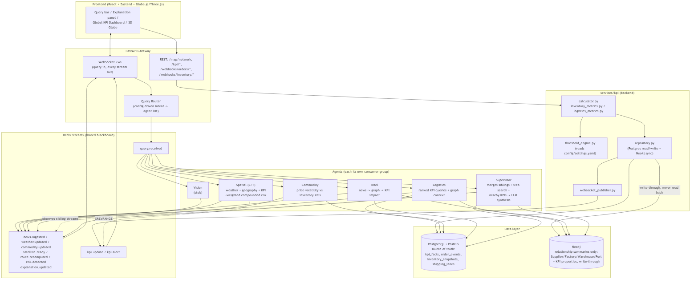
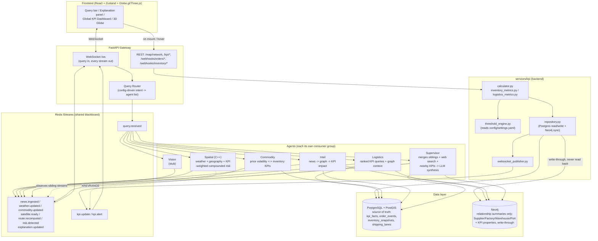

# Jarvis Supply Chain Intelligence Platform

Real-time operational intelligence system that monitors global events, tracks
live supply-chain KPIs, and maps their combined impact onto a knowledge graph
-- visualized through a Jarvis-style HUD over an interactive 3D globe. Full
product/architecture spec: [docs/PRD.md](docs/PRD.md).

## What this platform does

- **Ask natural-language questions** ("What's the fill rate in Southeast
  Asia?", "Which suppliers have the worst cycle time?", "Port congestion near
  Rotterdam?") and get an answer synthesized from live news, geocoding, the
  supply-chain graph, and real KPI data -- not a canned response.
- **Track 10 supply-chain KPIs** end-to-end: Inventory Turnover, Inventory
  Accuracy, Days on Hand, Rate of Return, Backorder Rate, Order Fill Rate,
  Perfect Order Rate, On-Time Shipping, Order Cycle Time, and Order Picking
  Accuracy -- computed from real order/inventory events, thresholded entirely
  from config (nothing hardcoded), and pushed to every connected client the
  moment they change.
- **Visualize the whole network as a 3D globe** (Globe.gl + Three.js):
  facilities with concentric KPI-health rings, shipping routes animated by
  cycle time and colored by on-time performance, pulsing alert rings on
  threshold breaches, and temporary correlation arcs when a news event may
  degrade a nearby facility's KPIs.

## Architecture



<details>
<summary>Mermaid source (renders inline on GitHub/GitLab; edit this to regenerate the PNG above)</summary>



</details>

**Principles enforced throughout:** PostgreSQL is always the source of truth;
Neo4j only ever receives a write-through summary and is never read to derive
a KPI value; every threshold lives in `config/settings.yaml`, never in code;
agents only communicate through Redis Streams, never by calling each other
directly.

## Layout

```
backend/
  app/
    api/            FastAPI routes: query_router, websocket, map_router, kpi_router (webhooks + reads)
    core/            Config loader, Postgres/Neo4j clients, Redis StreamBus
    models/          Pydantic schemas (query.py, kpi.py)
    services/kpi/     calculator, inventory_metrics, logistics_metrics,
                      threshold_engine, repository (Postgres + Neo4j sync),
                      websocket_publisher
  tests/            pytest for the KPI formulas + threshold engine
agents/
  common/           Shared BaseAgent, Redis StreamBus, Postgres client, config loader
  intel/            News search + geocoding + nearby-facility KPI impact
  spatial/          C++: geofencing + KPI-weighted compounded operational risk
  vision/           Satellite/weather imagery agent (still a stub)
  logistics/        KPI-aware: ranked Postgres queries joined with Neo4j graph context
  commodity/         Commodity price volatility <-> inventory KPI correlation
  supervisor/       Merges siblings + web search + nearby KPIs, asks the LLM
                      for one final answer (PRD's Narrative Agent role)
etl/                Celery Beat + workers for ambient news/weather/commodity/satellite ingestion
frontend/
  src/components/globe/   GlobeScene, FacilityLayer, RouteLayer, AlertLayer,
                          CorrelationLayer, CameraController, GlobeHUD
  src/components/HUD/     HudPanel, AgentConsole, ExplanationPanel, InfoPopup, SourceCard
  src/components/HUD/kpi/ KpiRing, KpiPanel, AlertPulse, TrendSparkline, GlobalDashboard
  src/store/useStore.ts   Single Zustand store: WS trace, network/KPI/globe state
databases/
  postgres/         init.sql (sessions/alerts/commodity_history) + kpi.sql (KPI schema)
  postgis/          Geofences/shipping lanes schema + seed data
  neo4j/            constraints.cypher, seed.cypher, kpi_properties.cypher
config/settings.yaml  Central, hot-editable config: ETL schedules, risk
                      thresholds, query-router intents, agent priorities,
                      map layers, and the `kpi:` section (thresholds/
                      direction/interval/alert per KPI) -- no hardcoded values
requirements-dev.txt  Union of every Python service's deps, for one shared venv
```

## Running locally

### 1. Start the data services

```
docker compose up -d
```

Brings up Redis (`localhost:6379`), PostgreSQL/PostGIS (`localhost:5432`),
and Neo4j (`localhost:7687`, browser at `localhost:7474`). On a fresh clone
with no `.env` file, every native service and `docker-compose.yml` both
default to the same `change-me` password, so nothing needs configuring. If a
`.env` already exists in this checkout (see `.env.example` for the full list
of overridable values), its `NEO4J_PASSWORD`/`POSTGRES_PASSWORD` are what the
containers were actually created with -- docker compose auto-loads `.env`,
so those values win over `docker-compose.yml`'s fallback defaults.

For Supervisor LLM synthesis, copy `.env.example` to `.env` and set
`OPENROUTER_API_KEY`. The default `OPENROUTER_MODEL=nex-agi/nex-n2-mini` is a
very low-cost paid model; you can switch to a `:free` OpenRouter model if you
prefer zero token cost over steadier availability. Keep `.env` local; don't
commit or paste keys into chat/logs.

One-time: load the Neo4j graph constraints, then the demo/seed data (a small
plausible supply-chain network -- suppliers/factories/warehouses/ports plus
shipping lanes and risk geofences -- so the map has something to render) —

```
docker compose exec neo4j cypher-shell -u neo4j -p <NEO4J_PASSWORD> -f /init/constraints.cypher
docker compose exec neo4j cypher-shell -u neo4j -p <NEO4J_PASSWORD> -f /init/seed.cypher
docker compose exec neo4j cypher-shell -u neo4j -p <NEO4J_PASSWORD> -f /init/kpi_properties.cypher
cat databases/postgis/seed.sql | docker compose exec -T postgres psql -U supply_chain -d supply_chain
```

Replace `<NEO4J_PASSWORD>` with whatever `NEO4J_PASSWORD` is set to in your
`.env` (docker compose auto-loads `.env` for the values in
`docker-compose.yml`, so the container's real password is whatever was in
`.env` *the first time the `neo4j_data` volume was created* -- `change-me`
only applies if you had no `.env` yet at that point). If you get "client is
unauthorized due to authentication failure," check `.env`'s `NEO4J_PASSWORD`
first before assuming something else is wrong.

The Postgres KPI tables (`kpi_facts`, `inventory_snapshots`, `order_events`) load
automatically from `databases/postgres/kpi.sql` on first container init (see
`docker-compose.yml`). If your `postgres_data` volume already existed before
this file was added, apply it manually instead:

```
cat databases/postgres/kpi.sql | docker compose exec -T postgres psql -U supply_chain -d supply_chain
```

### 2. Python services (backend, agents, ETL)

One shared virtualenv is simplest since the services share most of their
dependencies:

```
python -m venv .venv
.venv\Scripts\activate        # PowerShell: .venv\Scripts\Activate.ps1
pip install -r requirements-dev.txt
```

Then, each in its own terminal (all commands run from the repo root):

```
# Gateway
# run.py (not the bare `uvicorn` CLI) is required on Windows: it sets the
# selector event loop policy before uvicorn creates its loop, which psycopg's
# async mode needs -- setting it inside app/main.py runs too late, since the
# `uvicorn` CLI already creates a (Proactor) loop via asyncio.run() before it
# imports the app module.
cd backend; python run.py

# Agents (repeat per agent: intel, vision, logistics, commodity, supervisor)
python agents/intel/main.py

# ETL (needs both a worker and a beat scheduler)
# --pool=solo is required on Windows: Celery's default "prefork" pool needs
# fork(), which Windows doesn't support, and fails with a billiard/pool.py
# "not enough values to unpack" error without this flag.
cd etl; celery -A celery_app worker --pool=solo --loglevel=info
cd etl; celery -A celery_app beat --loglevel=info
```

The Spatial Agent is C++ (`agents/spatial/`) and needs hiredis, yaml-cpp, and
nlohmann-json available to build with CMake -- see `agents/spatial/Dockerfile`
for the exact packages if you want to build it natively; it's the one service
where using Docker directly (`docker build -f agents/spatial/Dockerfile .`) is
likely easier than installing those libraries on Windows.

### 3. Frontend

```
cd frontend
npm install
copy .env.example .env
npm run dev
```

Opens at `http://localhost:5173`. The globe uses three-globe's standard dark
Earth/bump/star-field textures by default (no API key required); override
`VITE_GLOBE_IMAGE_URL` / `VITE_GLOBE_BUMP_URL` / `VITE_GLOBE_BACKGROUND_URL`
in `frontend/.env` for custom textures.

## KPI Intelligence Pipeline

Order/inventory events enter the platform exclusively through five webhooks
(no ERP/WMS/OMS integration, no scheduler -- everything is request-triggered
and real-time):

| Endpoint | Effect |
|---|---|
| `POST /webhooks/orders/shipped` | Upserts `order_events`, recomputes `fill_rate` |
| `POST /webhooks/orders/delivered` | Recomputes `perfect_order_rate`, `order_cycle_time`, `on_time_shipping`, `picking_accuracy` |
| `POST /webhooks/orders/returned` | Recomputes `return_rate` |
| `POST /webhooks/orders/damaged` | Recomputes `perfect_order_rate` |
| `POST /webhooks/inventory/update` | Recomputes `inventory_accuracy`, `inventory_turnover`, `days_on_hand` |

Every recompute: (1) writes the new value to `kpi_facts` (Postgres, source of
truth), (2) write-through syncs the same value onto the corresponding Neo4j
node/relationship, (3) classifies it green/amber/red via
`config/settings.yaml`'s `kpi:` section, and (4) publishes it on `kpi.update`
(always) and `kpi.alert` (only if the configured threshold was breached) --
both forwarded to every connected browser over the existing WebSocket, the
same way ambient ETL updates already were.

Reads: `GET /kpi/network` (snapshot for the globe/HUD on load), `GET
/kpi/history` (sparklines), `GET /kpi/dashboard` (platform-wide rollup), `GET
/config/kpi-thresholds` (lets the frontend display real thresholds instead of
hardcoding them).

## Next steps

- Implement real fetch/parse logic in the weather/commodity/satellite ETL
  tasks (`etl/tasks/*.py`) and the Vision agent -- these are still stubs.
- Reconcile `shipping_lanes` (PostGIS, numeric id) with the `route_id` text
  identifier used by `order_events`/`kpi_facts`/Neo4j's `CONNECTS_TO`
  relationship -- they're different id spaces today, so route KPI overlays
  fall back to healthy/delayed/blocked status color until a shared key exists.
- Add authentication to the FastAPI gateway (PRD section 7 lists it as a
  gateway responsibility; not yet implemented).
