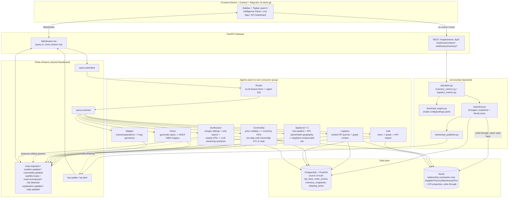

# Jarvis Supply Chain Intelligence Platform

## Product Requirements, System Architecture, and Implementation Status

This document describes the system **as actually built and running today**, not
a pre-implementation plan. Where a feature described here is stubbed,
partial, or disabled, that's called out explicitly rather than left implicit
-- see **§13 Known Gaps** for the full honest list. For setup instructions
and a file-by-file layout, see [../README.md](../README.md).

---

# 1. Executive Summary

The Jarvis Supply Chain Intelligence Platform is a real-time operational
intelligence system that monitors global events and maps their impact onto a
supply-chain knowledge graph, surfaced through a Jarvis-style command center:
a sidebar-navigated dashboard built around a live 2D map, KPI views, an
alerts center, and a context-sensitive AI intelligence panel.

Unlike a traditional chatbot or a rigid multi-agent pipeline, the platform
uses an asynchronous, event-driven architecture in which independent agents
collaborate through a shared Redis Streams blackboard -- no agent ever calls
another agent directly, and results stream to the frontend incrementally as
each agent finishes, not in one batched response.

The platform combines:

* Real-time global monitoring (news, weather, satellite imagery).
* Supply-chain graph intelligence (Neo4j).
* Live, real-value KPI tracking (10 formulas, PostgreSQL source of truth).
* Geospatial risk scoring (C++ Spatial Agent).
* Logistics and commodity analysis.
* An interactive command-center UI (React + MapLibre GL + deck.gl).

---

# 2. Product Goals

The system answers questions such as:

* "What's the fill rate in Southeast Asia?"
* "Which suppliers have the worst cycle time?"
* "Port congestion near Rotterdam?"
* "Typhoon near Taiwan Strait risk zone?"
* "Which factories depend on Supplier A?"
* "How has lithium pricing changed?" (logic implemented; live data pending
  the commodity ETL -- see §13)

Answers are synthesized from live news, geocoding, the supply-chain graph,
and real KPI data -- not canned responses. Clicking a facility, route, risk
zone, or alert on the map asks the equivalent question and gets the
identical live response a typed query would.

---

# 3. Core Principles

## 3.1 Asynchronous by Design

Agents never execute in a rigid sequential chain. Each agent is an
independent long-running process that:

* Listens on Redis Streams for work addressed to it (`self.name in
  payload["agents"]`, checked in `agents/common/base_agent.py`).
* Processes independently, with no knowledge of sibling agents' internals.
* Publishes its own result to its own output stream immediately on
  completion -- it does not wait for anyone else.
* Reports `agent_status` (`started` / `completed` / `error`, with elapsed
  ms) so the frontend's Agent Trace console shows real-time activity.

```text
User query
   |
Router (LLM-based intent classification)
   |
query_received  ---->  [intel | spatial | vision | logistics | commodity | mapper]
                              (each activated independently, in parallel)
   |
Redis Streams (per-agent result streams)
   |
Synthesizer (waits for siblings, adds its own web search + KPI grounding,
             asks an LLM, streams the answer token-by-token)
   |
Frontend (WebSocket)
```

## 3.2 Shared Blackboard Architecture

Redis Streams is the only channel agents use to communicate. Every stream
name is config-driven (`config/settings.yaml`'s `redis_streams:` section
maps a logical key like `"weather_updated"` to the actual Redis stream name
`weather.updated`) -- adding a stream is a config change, not a code change.

Real streams in use today:

```text
query_submitted      -- raw {query, session_id} from the WebSocket
query_received        -- Router's routing decision; kicks off specialized agents
query_router          -- same decision, republished for the frontend's activeAgents UI
agent_status          -- started/completed/error per agent, with elapsed_ms
news_ingested         -- Intel Agent's per-query result AND the ambient News ETL broadcast
weather_updated        -- ambient Weather ETL broadcast (Open-Meteo, real data)
commodity_updated       -- Commodity Agent's per-query result AND the ambient (stub) ETL broadcast
satellite_ready        -- Vision Agent's per-query result AND the ambient Satellite ETL broadcast
route_recomputed        -- Logistics Agent's ranked-KPI result
risk_detected           -- Spatial Agent's compounded operational risk result
explanation_updated      -- Synthesizer's final answer + sources + resolved location
explanation_chunk        -- Synthesizer's answer, streamed token-by-token
map_updated              -- Mapper's geocoded points for the current query
kpi_update / kpi_alert    -- every KPI recompute (webhook-triggered), broadcast to all clients
```

Ambient streams (no `session_id`) are broadcast to every connected client
and replayed from recent history on connect, so a fresh page load isn't
empty. Per-query streams (`session_id` set) are only forwarded to the
session that asked.

## 3.3 Progressive Rendering

The frontend never waits for every agent. Results render as they arrive:
agent status ticks into the trace console immediately, map layers (routes,
risk zones, alerts, live news pins) update continuously and independently of
any query, the answer streams in word-by-word, and proof (a real satellite
picture, web sources with real scraped images and descriptions, live news
articles) pops up automatically the moment each becomes available -- never
gated behind a click.

---

# 4. Operating Modes

## 4.1 Ambient Mode

Runs continuously, independent of any connected user, via Celery Beat +
workers (`etl/`):

| Pipeline | Interval | Source | Status |
|---|---|---|---|
| News | 5 min | GDELT + NewsAPI (+ ReliefWeb/RSS configured, not yet fetched) | Real |
| Weather | 15 min | Open-Meteo (free, keyless) | Real |
| Satellite | 45 min | NASA GIBS (free, keyless) | Real |
| Commodity | 60 min | — | **Stub** (§13) |

Ambient results broadcast to every connected client: news pins appear on
the live map as they're geocoded, weather risk feeds the Spatial Agent's
compounded score, satellite imagery refreshes, and KPI recomputes (from
order/inventory webhooks) push `kpi_update`/`kpi_alert` to everyone
regardless of who's asking.

## 4.2 Assistant Mode

When a user submits a query (by typing, or by clicking a facility/route/risk
zone/alert/news pin on the map -- both paths call the exact same
`sendQuery()`):

1. The Router classifies intent via an LLM call and decides which agents to
   activate.
2. The map flies to the resolved location, animated (deck.gl controlled
   view state + `FlyToInterpolator`).
3. The answer streams into the Intelligence Panel as short, scannable
   highlights (bulleted, not paragraphs).
4. Proof auto-pops as separate, clearly labeled floating windows the moment
   each becomes available: a real satellite picture, web sources (however
   many were actually found, each with a real scraped image and
   description where available), and the Intel Agent's own live news
   results (shown only if genuinely different from the web sources, deduped
   by URL).

---

# 5. Dynamic Agent Activation

`agents/router/main.py` is the Query Router: an LLM call (OpenRouter) that
reads the query text and returns the list of specialized agents to activate.
`mapper` and `synthesizer` are always included. On any failure (missing API
key, network error, bad JSON) it falls back to a hardcoded
`[intel, logistics, spatial, mapper, synthesizer]` -- `vision` and
`commodity` are deliberately excluded from the fallback (vision hits an
external API worth gating on real intent; commodity's data source is a stub
today anyway).

Example decision, published on both `query_received` (kicks off the agents)
and `query_router` (frontend UI):

```json
{
  "session_id": "...",
  "query": "Typhoon near Taiwan Strait risk zone?",
  "intent": "custom",
  "agents": ["vision", "spatial", "intel", "mapper", "synthesizer"]
}
```

### Example queries and what actually activates

| Query | Activated |
|---|---|
| "Typhoon near Taiwan Strait risk zone?" | intel, spatial, vision, mapper, synthesizer |
| "What's the fill rate in Southeast Asia?" | logistics, mapper, synthesizer |
| "Which factories depend on Supplier A?" | logistics, mapper, synthesizer |
| "How has lithium pricing changed?" | commodity, mapper, synthesizer |
| *(LLM unavailable)* | intel, logistics, spatial, mapper, synthesizer (fallback) |

---

# 6. Command-Center User Experience

The UI is a persistent shell (`frontend/src/components/layout/AppShell.tsx`)
-- collapsible Sidebar, Topbar with AI search, a routed center view
(`react-router-dom`), and a context-sensitive right-hand Intelligence Panel
-- not a single-page HUD floating over a 3D globe (that was an earlier,
now-replaced design; see the "not built this way" note in §13).

## 6.1 Interactive World Map

Built with **MapLibre GL + deck.gl** (`frontend/src/components/map/`), not
Mapbox GL -- MapLibre is the open-source, keyless fork, paired with
OpenFreeMap's free hosted `dark` style (no API key, no rate limits).

Layers, all clickable, all gated behind Settings toggles
(`useWorkspaceStore.mapLayers`) so the map isn't permanently cluttered:

* **Facilities** -- suppliers/factories/warehouses/ports, fill color by
  type (stable, legend-matched), outline color by worst KPI severity (a
  separate visual channel, not overloaded onto the same color).
* **Routes** -- colored by real `on_time_shipping` KPI when the route has
  joined data (via `shipping_lanes.route_id`, reconciled with
  `kpi_facts`/Neo4j's `CONNECTS_TO.route_id`), falling back to the PostGIS
  status enum (healthy/delayed/blocked) otherwise.
* **Risk geofences** -- PostGIS polygons, colored by risk level.
* **KPI alerts** -- pulsing markers for any entity (including routes, whose
  location is an origin/destination midpoint, not a single point) with a
  recent threshold breach.
* **Live news pins** -- the ambient News ETL's geocoded articles, updating
  independently of any query.
* **Commodity heatmap** -- off by default; the underlying data is still
  mock/random pending the commodity ETL (§13).

Every layer's `onClick` routes through the same select → fly (animated,
controlled deck.gl view state) → `sendQuery()` pipeline, so clicking gets
identical live behavior to typing the equivalent question.

## 6.2 Intelligence Panel

Right-hand panel (`frontend/src/components/intelligence/IntelligencePanel.tsx`):
shows the streaming answer when one exists, a live "Orchestrating agents..."
progress view while waiting, or a lightweight KPI/favorite/pin card for
whatever map entity is currently selected.

## 6.3 Proof Pop-Windows (not click-to-reveal)

`frontend/src/components/layout/AppShell.tsx` watches store state and
auto-opens floating, draggable popups (`InfoPopup`) the instant each kind of
proof is ready -- never requiring a click on a sentence:

* **Satellite view** -- a real NASA GIBS Worldview Snapshot JPEG, generated
  client-side from the resolved location (`frontend/src/lib/nasaGibs.ts`),
  so a picture appears for every query/click that resolves a location, not
  only the ones the Router happened to send to Vision.
* **Web sources** -- every source the Synthesizer's web search found (not a
  hardcoded count), each rendered with a real scraped `og:image`/
  `twitter:image` where the source page has one, plus its snippet
  description -- so a video, article, or image source is never just a bare
  link.
* **Live news** -- the Intel Agent's own per-query NewsAPI results, shown
  only when they add articles genuinely distinct (by URL) from the web
  sources popup.

Multiple popups can be open simultaneously, cascaded so they don't stack
exactly on top of each other, each carrying a label identifying which kind
of proof it is.

## 6.4 Agent Trace Console

A live terminal (`frontend/src/components/HUD/AgentConsole.tsx`) shows only
"highlight" events (agent status, the routing decision, final answer,
news/weather/risk/alert broadcasts) -- high-frequency streams like individual
LLM tokens or continuous KPI ticks update state but deliberately don't spam
the console with a line each.

## 6.5 KPI Visualization

Concentric per-facility KPI rings on the map, a KPI Dashboard view (trend
sparklines, entity picker, full breakdown with real formulas/thresholds from
config), and a Command Center view (platform-wide rollup + recent alerts +
trace feed) -- all reading real values, never hardcoded.

---

# 7. Architecture



Deployment shape: only Redis, PostgreSQL/PostGIS, and Neo4j run in Docker
(`docker-compose.yml`). The FastAPI gateway, every agent, the Celery
ETL workers/beat, and the Vite frontend run natively on the host --
there's no `backend`/`agent-*`/`frontend` container today.

---

# 8. Agent Responsibilities (as implemented)

## Router (`agents/router/main.py`)

LLM-based (OpenRouter) intent classifier. Decides which of the 7
activatable agents (intel, logistics, commodity, spatial, vision, mapper,
synthesizer) a query needs. `mapper` and `synthesizer` always included.

## Mapper (`agents/mapper/main.py`)

Listens directly on `news_ingested` and `explanation_updated` (not a
routed query handler) and republishes geocoded points as `map_updated` for
the frontend's map-pin layer.

## Intel (`agents/intel/main.py`)

Live NewsAPI search keyed on the query text, Nominatim geocoding, then a
Neo4j bounding-box lookup for nearby Warehouse/Port/Factory nodes and a
plain-language KPI-impact note per facility (real PostgreSQL `kpi_facts`
values, not invented).

## Spatial -- C++ (`agents/spatial/src/main.cpp`)

Compounds five weighted components into one operational risk score per
entity (weights in `config/settings.yaml`'s `spatial.risk_weights`):
`fill_rate`, `inventory_accuracy`, and `picking_accuracy` are real
(`kpi_facts`); `weather` is real (Open-Meteo per-entity risk, read off the
`weather_updated` stream); `geography` is a neutral 0.5 placeholder pending
real PostGIS `ST_*` geometry work. Reads Redis directly via hiredis --
never touches Postgres or Neo4j itself, only the ambient `kpi_update`/
`weather_updated` broadcasts.

## Vision (`agents/vision/main.py`)

Geocodes the query (Nominatim, filtering out weather/disaster jargon like
"Typhoon" so it doesn't get geocoded as a literal place name), then returns
a real NASA GIBS Worldview Snapshot image URL and WMTS tile template
centered on the resolved point -- both free, keyless, no synthetic imagery.

## Logistics (`agents/logistics/main.py`)

Keyword-parses the query for a KPI name, entity type, sort direction
(best/worst), and result count, then runs a ranked SQL query against
`kpi_facts` (latest value per entity) joined with Neo4j for names/
coordinates. Handles route entities specially (`CONNECTS_TO.route_id`
match, no `:Route` node exists in the graph).

## Commodity (`agents/commodity/main.py`)

Correlates commodity price volatility against inventory-turnover/
days-on-hand trends as independently-computed signals -- explicitly never
claims causal linkage, since there's no table connecting a commodity code to
a specific supplier. Real query logic; effectively returns nothing today
because the commodity ETL that's supposed to populate `commodity_history`
is still a stub (§13).

## Synthesizer (`agents/synthesizer/main.py`)

Waits for the sibling agents this query activated, runs its own DuckDuckGo
web search in parallel (enriched with real `og:image`/`twitter:image`
scraping per result, unlimited result count, politely concurrency-capped),
resolves a map location, grounds the answer in nearby real KPI values, then
streams an OpenRouter LLM's answer token-by-token as short bullet
highlights (not paragraphs) via `explanation_chunk`, publishing the final
merged answer + all sources on `explanation_updated`.

## Supervisor -- **dead code, not wired in**

`agents/supervisor/main.py` still exists (Synthesizer began as a fork of
it) but is disabled in config (`agents.supervisor.enabled: false`) and is
not one of the 7 agents the Router can activate. Safe to delete; kept for
now only as history.

---

# 9. Data Layer

## Neo4j

Four node labels only: `Supplier`, `Factory`, `Warehouse`, `Port` (unique-id
constrained). **There is no `:Route` node** -- a shipping route is a
`(:Port)-[:CONNECTS_TO {route_id, mode, distance_km}]->(:Port)` relationship,
and `route_id` (e.g. `"route-shanghai-la"`) is the shared key joined against
PostGIS's `shipping_lanes.route_id` and Postgres's `kpi_facts.entity_id`/
`order_events.route_id`. Other relationships: `SUPPLIES`, `SHIPS_TO`,
`ROUTES_THROUGH`. KPI values are write-through synced onto nodes/
relationships from Postgres -- Neo4j is never read to *derive* a KPI value,
only to resolve names/coordinates/graph context.

## PostgreSQL

`kpi_facts` (source of truth for every KPI value), `order_events`,
`inventory_snapshots`, plus materialized views for aggregate queries,
sessions/alerts/`commodity_history` (schema exists, unpopulated -- §13).

## PostGIS

`shipping_lanes` (`route_id` TEXT column, reconciled with Neo4j/Postgres as
of the migration in `databases/postgis/migrate_route_id.sql`) and
`geofences`. Real `ST_AsGeoJSON` reads back out through `/map/network`; no
`ST_Contains`/`ST_Intersects`/`ST_Buffer` spatial analysis is implemented
yet (§13 -- Spatial Agent's `geography` component is the placeholder this
would replace).

## Redis

Streams (the blackboard, §3.2) plus ambient-replay history via
`XREVRANGE`. No separate cache or worker-state usage beyond Celery's own
broker/result backend.

---

# 10. Ambient ETL Pipelines

```text
External source (real, keyless where possible)
        |
Celery Beat (schedule from config/settings.yaml's etl.*.interval_minutes)
        |
Celery Worker (--pool=solo on Windows)
        |
Redis Streams (ambient broadcast, no session_id)
        |
Agents (Spatial reads weather_updated; Intel/Vision/Logistics/Commodity read on-demand)
        |
Frontend (live map pins, KPI rings, alert layer)
```

| Pipeline | Source | Status |
|---|---|---|
| News | GDELT (keyless) + NewsAPI (keyed) | Real |
| Weather | Open-Meteo (free, keyless) | Real |
| Satellite | NASA GIBS (free, keyless, Worldview Snapshot API) | Real |
| Commodity | — | **Stub**, publishes `{"prices": []}` (§13) |

---

# 11. Technology Stack

## Frontend

React 18 + TypeScript, **MapLibre GL + deck.gl** (not Mapbox), React Router,
Tailwind CSS, two Zustand stores (`useJarvisStore` for live WS/domain data,
`useWorkspaceStore` for nav/UI state, persisted to localStorage).

## Backend

FastAPI, Redis Streams (`redis.asyncio`), WebSockets. No Celery in the
gateway itself -- that's ETL-only.

## Agents

Python (router, mapper, intel, vision, logistics, commodity, synthesizer) +
C++ (spatial, via hiredis/yaml-cpp/nlohmann-json, built with CMake or the
provided Dockerfile).

## ETL

Celery + Celery Beat.

## Databases

Neo4j 5, PostgreSQL 16 + PostGIS 3.4, Redis 7.

## Infrastructure

Docker Compose for the three data services only (§7). No NGINX, no
containerized app services, no orchestration beyond Compose.

---

# 12. Non-Functional Requirements

## No Hardcoded Values

Genuinely enforced: every threshold, interval, agent priority, map-layer
toggle, and intent keyword lives in `config/settings.yaml`. No code branches
on a specific country/supplier/port name -- seed data (`databases/*/seed.*`)
is data, not logic, and the codebase never special-cases it.

```python
# Forbidden anywhere in this codebase:
if country == "Taiwan":
    trigger_storm_pipeline()
```

## Runtime Geographic Resolution

Locations are resolved dynamically via Nominatim geocoding (Vision, Intel,
Synthesizer each do their own, since they run as independent agents) --
never a hardcoded coordinate table.

## Configuration-Driven Design

ETL schedules, risk thresholds, agent priorities, map layers, KPI formulas'
thresholds/direction, and the Spatial Agent's risk weights all come from
`config/settings.yaml`, hot-editable without a code change.

## Known, Unaddressed Gaps

**Authentication is not implemented.** Every REST endpoint (including the
KPI webhooks) and the WebSocket are unauthenticated, and CORS is wired wide
open (`*`) for local dev (`backend/app/main.py` explicitly comments that
production must set a strict `CORS_ORIGINS` and drop the wildcard). Not
appropriate to expose beyond local development as-is.

---

# 13. Known Gaps

Honest list of what's stubbed, placeholder, or not yet built -- kept in sync
with [../README.md](../README.md)'s "Next steps":

- **Commodity ETL is a stub** (`etl/tasks/commodity.py`) -- publishes
  `{"prices": []}` and never calls a market API or writes
  `commodity_history`. The Commodity Agent's correlation logic is real but
  has nothing to correlate against until this is implemented (needs a
  market-data source decision).
- **Spatial Agent's `geography` risk component** is a neutral 0.5
  placeholder pending real PostGIS `ST_Contains`/`ST_Intersects`/
  `ST_Distance` geofencing work.
- **No authentication** on the gateway (§12).
- **`agents/supervisor/main.py` is dead code** -- disabled, unreachable,
  superseded by `agents/synthesizer/main.py`. Safe to delete.
- **`backend/app/api/query_router.py`'s config-driven `route_query()`** is
  vestigial -- imported but never called; actual routing is entirely
  `agents/router/main.py`'s LLM classifier. `config/settings.yaml`'s
  `query_router.intents` section (including its stale `supervisor`
  references) is correspondingly unused.
- **Frontend**: marker clustering at low zoom; full per-entity-type
  Intelligence Panel detail (KPI history/news per facility|route|geofence,
  beyond the current basic card); Investigation Workspace beyond
  create/list (pinning, comparisons, event replay); search autocomplete;
  persisted/paginated alert & news history (currently session-bounded ring
  buffers); time-playback; a `/graph/related/:id` endpoint for relationship
  traversal.
- **News ETL**: ReliefWeb/RSS/local-media sources are configured
  (`etl.news.sources`) but only GDELT + NewsAPI are actually fetched.

---

# 14. Final Vision

This platform is not a chatbot bolted onto a map. It's a continuously
running intelligence system that watches the world in the background,
understands real supply-chain dependencies through a real graph, scores risk
from real (and, where marked above, placeholder) signals, and turns a typed
question or a single map click into the same live, streamed, provably-sourced
answer -- with the map, the KPIs, the news, and the AI explanation staying
visibly connected in one workflow instead of siloed across tabs.
